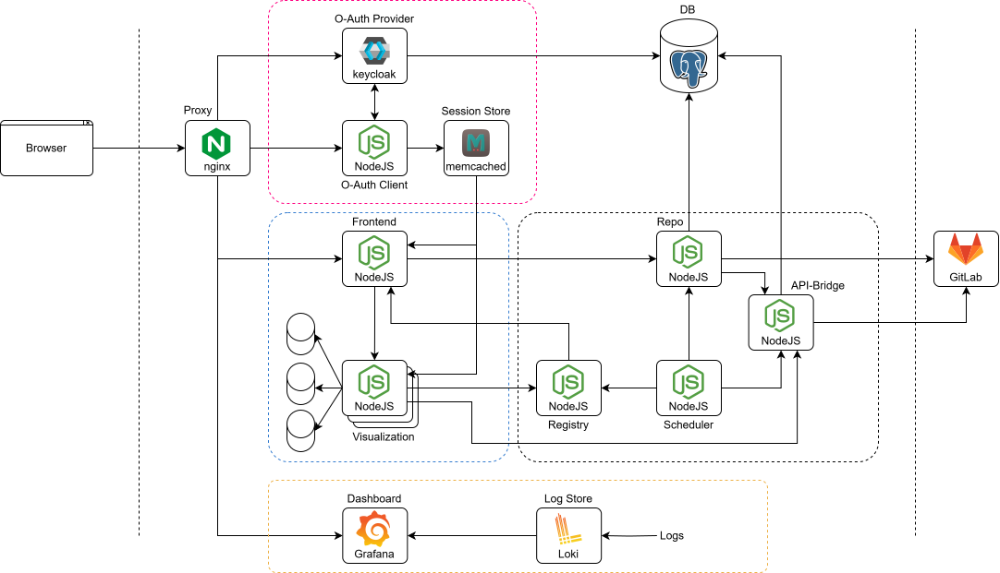

# Trinocular

## Setup
Follow the steps below to setup the project on your machine for development.
You only need to do this once.

1. Pull the repo from GitLab
2. Take a look at the `secrets` section of the `docker-compose.yml`. You need to create each text file
   and fill it with a secret string. Make sure not to include any whitespace (including newlines) when
   saving the file if your editor has autoformatting configured. For more details check out the ReadMe
   in the secrets directory.
3. In the base directory of the repo run `docker-compose build`.
4. In the base directory of the repo run `docker-compose up`. Now the project should start up for the 
   first time. For now it should not matter if some errors get printed. Check that the nginx, postgres
   and keycloak services started up and are healthy.
5. Setup keycloak by creating a new realm with a user and client.
   1. Navigate to the admin login page under `localhost:8080/keycloak`.
   2. Login as `admin` using the `keycloak_admin_secret`.
   3. Create new realm (Button inside the drop down left top) and name it "trinocular"
   4. Select the "trinocular" realm in the drop down
   5. Create new user in the "trinocular" realm with username, email, firstname, lastname. Also set
      "email verified" to true.
   6. Select the credentials tab of the new user
   7.  Set Password a new password. Deselect the "temporary" option!
   8.  Create new client in the "trinocular" realm and name it "trinocular_client". Then go to "next".
   9.  In the capability config of the client check the "Standard flow" checkbox. Then go to "next".
   10. In the login settings of the client set the valid redirect URI to "http://localhost:8080/auth/*". Safe the client.
   11. Logout.
   12. Keycloak should show the OIDC information as JSON under `http://localhost:8080/realms/trinocular/.well-known/openid-configuration`
6.  Hit `Ctrl-C` and wait for everything to shutdown. This should only take a few seconds.
7.  Start the system again with `docker compose up`. Now, no errors should be visible in the log.
8.  Navigate to `http://localhost:8080` and click `login`. You should now be able to login via keycloak.
9.  To gain better editor support for eg. types and autocomplete, install the node dependencies for the
   services. Run `npm i` (or better `pnpm i`) in each service directory that has a `package.json`.

## Commit namespace
Each commit summary must be prefixed with a namespace, to make it easy
to see what part of the system was changed. Below are a few examples.

```
Doc: Added section about commits in the ReadMe

Postgres: Added a health check

Docker: Moved secret files to '/secrets'

Fronted: Prevent the navbar from overflowing on mobile
```

The following namespaces exist for general parts of the project:
- Doc: Anything related to documentation and non source files used for description of the project.
- Docker: Anything related to containerization, that is not specific to a certain container or container internals.

Each service has its own commit namespace:
- Nginx
- Keycloak
- Memcached
- Postgres
- Auth
- Frontend
- Registry

Visualization services have their name as the commit namespace.
- Demo: The demo visualization service.

## Services

- __nginx:__ Proxy server that routes incoming web requests to the respective service based on the
  request path.

- __keycloak:__ O-Auth provider that handles user authentication and initiates user sessions. It allows
  users to login and handles everything related to security. It also allows for user management, 
  verification and roles.

- __memcached:__ Simple in-memory key-value-store database. It stores all active user sessions and 
  makes it possible for other servives to check whether a request is authenticated.

- __postgres:__ Relational SQL database.

- __auth:__ Authentication service that handles the communication with the O-Auth provider and creates
  user sessions.

- __frontend:__ Delivers the frontend website to the browser. Communicates and proxies requests to the
  visualization services that hook into the system.

- __registry:__ Acts as a simple notification service based on HTTP pub/sub. Services can register 
  themselves and advertise their abilities with additional data fields. Visualizations use the registry
  to add themselves to the system on startup, while the frontend listens for notifications.

## JS service libs

Common code that is shared across multiple services is factored out into libraries/node modules that
get installed into to the service images as part of the docker build process. The modules are next to
the services in the `/src` directory and are referred to via relative paths when importing.

- __common:__ Contains code common to most services.
- __auth-utils:__ Contains the user sessions authentication middleware and useful functions related
  to authentication.

## Environment Files

Configuration constants are provided to the services via environment variables that get injected into
the container on startup. Do not rely on the `.env` files being copied into the container image.
Instead specify a service's environment in the `docker-compose.yml` and let docker inject the variables.

## Secrets

While most constants needed for configuration are provided via environment variables that are defined in
`.env` files, secrets such as passwords or encryption keys are stored elsewhere. Each secret is stored
in its own text file (with `.txt` file extension!) in the `/secrets` directory. In the `docker-compose.yml`
the secrets are listed and named, so that each service container can specify which secrets it needs.
The secrets get mounted as files into the `/run/secrets` directory of each service on startup, where
they can read them.

In case of a NodeJS service, use the `readSecretEnv()` function provided by the `common` module, to
automatically load secrets into Node's copy of the environment variables (`process.env`). It works
by looking through all keys of `process.env` and loading the file contents for all vars that end
with `SECRET_FILE` and point to a file inside `/run/secrets`.

```Shell
# This loads the contents of '/run/secrets/session_secret' into 
# a variable called 'SESSION_SECRET'
SESSION_SECRET_FILE= /run/secrets/session_secret

# Ignored: Does not end with 'SECRET_FILE'
MY_RANDOM_VAR= "hello world"

# Ignored: Does not point to a file in '/run/secrets'
MY_SECRET_FILE= /some/random/path
```


## Setting `NODE_ENV`

Some NodeJS libraries check the `NODE_ENV` environment to behave differently whether
they run in development or production mode. This is [bad and should be avoided][node_env].
In the `docker-compose.yml` file NodeJS services have their environment always set to
"production". If you need to do some extensive debugging with additional error messages from
eg. handlebars, you can temporarily change it back to "development". But do not commit
this change.


## Architecture




## Database Inspection

To inspect the data stored in the databases of the system, different methods exist depending
on the database in question.

### Frontend Service

The frontend service hosts its own local SQLite instance and a special webpage that dumps the
contents of the database. You first need to enable the db viewer page via an environment variable
in the `.env` file as shown below. Then navigate to `localhost:8080/db-viewer` after logging in.
Up to 100 rows for each table get displayed as separate tables.

```Shell
ENABLE_DB_VIEWER= true
```

### Repository Service

To connect to the PostgreSQL instance used by the repository service, you need to use a DB viewer 
application such as [DBeaver][dbeaver]. The default port is mapped in the `docker-compose.yml`. Use
the following connection parameters on your local machine.

- Host: `localhost:5432`
- User: `trinocular_db_user`
- Passsword: The value you set in the `/secrets/postgres.txt` file


[node_env]: https://nodejs.org/en/learn/getting-started/nodejs-the-difference-between-development-and-production
[dbeaver]: https://dbeaver.io/


