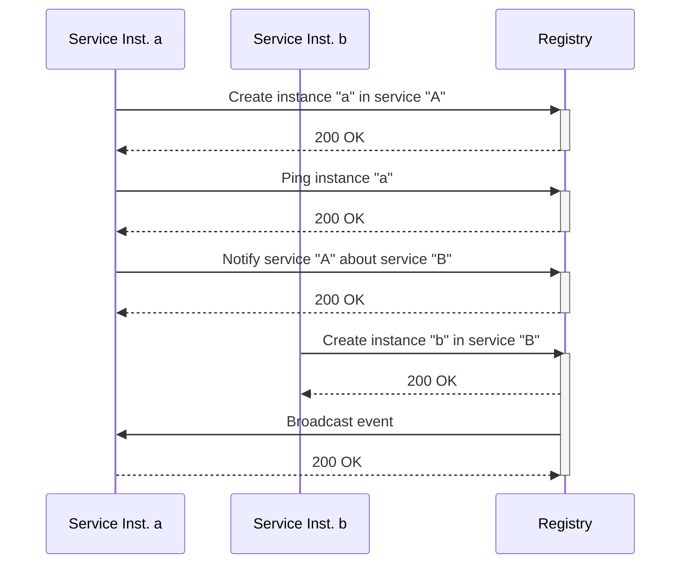

# Registry Service

## Description

The Registry Service manages visualization services. It plays a crucial role in Trinoculars
microservice and
micro-frontend architecture. It is responsible for managing (add, delete) visualization service
instances and providing
them to subscribers (pub/sub architecture).

Term clarification:

* Visualization Service: Container-Service (a server instance) that offers one or many visualizations
* Visualization Group: Groups one or many Visualization Services together

## Dockerfile

- The Dockerfile sets up the environment for the Registry Service.
  - Load required modules
  - Copy the source code
  - Expose the port

## Service Instance Management

The Registry Service allows for the management of service instances, including health checks and notifications. Service instances are identified by their hostname, hence the combination of service (group) name and service instance hostname needs to be unique.

Additionally, Subscribers can subscribe to notifications to retrieve all available visualizations.




## Endpoints

All endpoints are API secured.

### `GET` /service/:serviceName

Retrieve the details of a visualization group.

#### Path parameters:

- `serviceName` Name of the visualization group

#### Response Body:

Array of visualization service data, containing:

```json
[
  {
    "hostname": "example.com",
    "healthCheck": "/health",
    "healthy": true,
    "data": {}
  },
  {
    "hostname": "example.com",
    "healthCheck": "/health",
    "healthy": true,
    "data": {}
  }
]
```

* hostname: Hostname of the visualization service
* healthCheck: Health check endpoint of visualization service
* healthy: Whether the service is currently healthy
* data: Containing information about the concrete visualizations

Example data of a service providing two visualizations:
```json
{
  "visualizations": [
    {
      "name": "demo-apples",
      "displayName": "Demo - Apples",
      "framePath": "index.html?show=apples"
    },
    {
      "name": "demo-oranges",
      "displayName": "Demo - Oranges",
      "framePath": "index.html?show=oranges"
    }
  ]
}
```

#### Response Codes

* 404: Visualization service not found
* 200: Visualization service found

---

### `PUT` /service/:serviceName/:hostname

Add a new visualization service to the group or update an existing one. If the group is not existing it will be created.

#### Path parameters

- `serviceName` Name of the visualization group
- `hostname` Hostname of the service to add

#### JSON Body:

```json
  {
  "healthCheck": "/health",
  "pingTTL": 10000,
  "data": {
    "visualizations": [
      {
        "name": "demo-apples",
        "displayName": "Demo - Apples",
        "framePath": "index.html?show=apples"
      },
      {
        "name": "demo-oranges",
        "displayName": "Demo - Oranges",
        "framePath": "index.html?show=oranges"
      }
    ]
  }
}
```

* healthCheck: Health check endpoint of visualization service
* pingTTL: Allowed time to pass between pings from the service before it is declared unhealthy. The value is set in milliseconds (ms).
* data: Containing information about the concrete visualizations

#### Response Codes

* 422: Invalid Body
* 200: Visualization service updated on group
* 201: Visualization service added to group

---

### `DELETE` /service/:serviceName/:hostname

Delete a visualization service instance.

#### Path parameters

- `serviceName` Name of the visualization group
- `hostname` Hostname of the service to delete

#### Response Codes

* 404: Visualization group or service not found
* 200: Visualization service deleted

---

### `PUT` /service/:serviceName/:hostname/ping

Lets a registered service instance ping the registry, to indicate
that it is still healthy. Pings need to be sent within the set 
pingTTL time.

#### Path parameters

- `serviceName` Name of the visualization group
- `hostname` Hostname of the service to delete

#### Response Codes

* 404: Visualization group or service not found
* 200: Visualization service deleted

---

### `ALL` /service/:serviceName/broadcast/*

Send a message to all subscribers of a visualization group.

Path parameters:

- `serviceName` Name of the service
- `*` Path to broadcast

#### JSON Body:

Use the correct body for the broadcast path.

#### Response Codes

* 404: Visualization group not found
* 502: Broadcasting failed to at least one service instance (Service did not respond or responded with not-ok status code)
* 200: Message broadcasted

---

### `POST` /service/:serviceName/notify/:subscriber/broadcast/*

Adds a subscriber to a visualization group. This subscriber is notified if new
visualizations services are added. Duplicated subscribers are ignored.

#### Path parameters

- `serviceName` Name of the service
- `subscriber` Name of service to notify when events occur
- `*` Path to broadcast

#### JSON Body:

Use the correct body for the broadcast path.

#### Response Codes

* 200: Subscriber added

---

### `DELETE` /service/:name/notify/:subscriber/broadcast/*

Removes a subscriber from the notify list of a visualization group. All path parameters need to be
the same in order to delete a subscriber (subscriber could subscribe with different paths).

Path parameters:

- `name` Name of the service
- `subscriber` Name of subscriber to remove
- `*` Path to broadcast

#### Response Codes

* 404: Subscriber or Visualization group not found
* 200: Subscriber removed

---

## Tutorials

### How to create or update a new service instance

1. Send a `PUT` request to `/service/:serviceName/:hostname` with the service instance details.
2. The service will validate the request and create/update a new instance if valid.

## Classes

### `Registry`

A singleton class that maintains a global registry of services.

### `Service`

Represents a visualization group, containing multiple visualization services.

### `ServiceInstance`

Manages an individual visualization service instance, including its health checks.

### `NotificationSubscriber`

Represents a subscriber that listens for updates on a service.
