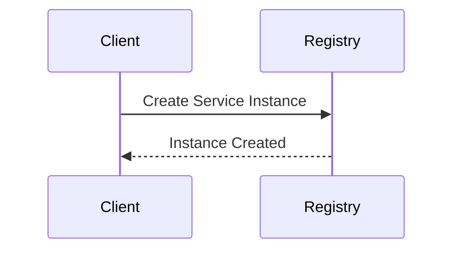

# Registry Service

## Description

The Registry Service manages visualization services. It plays a crucial role in Trinoculars
microservice and
micro-frontend architecture. It is responsible for managing (add, delete) visualization service
instances and providing
them to subscribers (pub/sub architecture).

Term clarification:

* Visualization Service: Container that offers one or many visualizations
* Visualization Group: Groups one or many Visualization Services together

## Dockerfile

- The Dockerfile sets up the environment for the Registry Service.
  - Load required modules
  - Copy the source code
  - Expose the port

## Service Instance Management

The Registry Service allows for the management of service instances, including health checks and notifications.

Additionally, Subscribers can subscribe to notifications to retrieve all available visualizations.




## Endpoints

All endpoints are API secured.

### `GET` /service/:name

Retrieve the details of a visualization group.

#### Path parameters:

- `name` Name of the visualization group

#### Response Body:

Array of visualization service data, containing:

```json
  {
  "0": {
    "hostname": "example.com",
    "healthCheck": "/health",
    "data": {}
  },
  "1": {
    "hostname": "example.com",
    "healthCheck": "/health",
    "data": {}
  }
}
```

* id: ID of the visualization service in the visualization group (used in following endpoints as :id
  parameter)
* hostname: Hostname of the visualization service
* healthCheck: Health check endpoint of visualization service
* data: Containing information about the concrete visualizations

`````json
{
  "visualizations": [
    {
      "name": "demo-apples",
      "displayName": "Demo - Apples",
      "framePath": "index.html?show=apples"
    },
    {
      "name": "demo-oranges",
      "displayName": "Demo - Oranges",
      "framePath": "index.html?show=oranges"
    }
  ]
}
````` 

#### Response Codes

* 404: Visualization service not found
* 200: Visualization service found

### `POST` /service/:name

Add a new visualization service to the group. If the group is not existing it will be created.

Path parameters:

- `name` Name of the visualization group

#### JSON Body:

```json
  {
  "hostname": "example.com",
  "healthCheck": "/health",
  "data": {
    "visualizations": [
      {
        "name": "demo-apples",
        "displayName": "Demo - Apples",
        "framePath": "index.html?show=apples"
      },
      {
        "name": "demo-oranges",
        "displayName": "Demo - Oranges",
        "framePath": "index.html?show=oranges"
      }
    ]
  }
}
```

* hostname: Hostname of the visualization service
* healthCheck: Health check endpoint of visualization service
* data: Containing information about the concrete visualizations

#### Response Body

````json
{
  "id": 0
}
````

#### Response Codes

* 422: Invalid Body
* 409: Visualization instance for that group already exists
* 200: Visualization service added to group

### `PUT` /service/:name/:id

Update an existing visualization service instance in a group.

Path parameters:

- `name` Name of the visualization group
- `id` ID of the visualization service

#### JSON Body:

[Same as POST /service/:name](#post-servicename)

#### Response Codes

* 404: Visualization group or visualization service not found
* 422: Invalid Body
* 200: Visualization service updated

### `DELETE` /service/:name/:id

Delete a visualization service instance.

Path parameters:

- `name` Name of the service
- `id` ID of the service instance

#### Response Codes

* 404: Visualization group or service not found
* 200: Visualization service deleted

### `ALL` /service/:name/broadcast/*

Send a message to all subscribers of a visualization group.

Path parameters:

- `name` Name of the service
- `*` Path to broadcast

#### JSON Body:

Use the correct body for the broadcast path.

#### Response Codes

* 404: Visualization group not found
* 200: Message broadcasted

### `POST` /service/:name/notify/:subscriber/broadcast/*

Adds a subscriber to a visualization group. This subscriber is notified if new
visualizations services are added.

Path parameters:

- `name` Name of the service
- `*` Path to broadcast

#### JSON Body:

Use the correct body for the broadcast path.

#### Response Codes

* 200: Subscriber added

### `DELETE` /service/:name/notify/:subscriber/broadcast/*

Removes a subscriber from the notify list of a visualization group. All path parameters need to be
the same in order to delete a subscriber (subscriber could subscribe with different paths).

Path parameters:

- `name` Name of the service
- `subscriber` Subscriber to remove
- `*` Path to broadcast

#### Response Codes

* 404: Subscriber or Visualization group not found
* 200: Subscriber removed

## Tutorials

### How to create a new service instance

1. Send a `POST` request to `/service/:name` with the service instance details.
2. The service will validate the request and create a new instance if valid.

### How to update a service instance

1. Send a `PUT` request to `/service/:name/:id` with the updated service instance details.
2. The service will validate the request and update the instance if valid.

## Classes

### `Registry`

A singleton class that maintains a global registry of services.

### `Service`

Represents a visualization group, containing multiple visualization services.

### `ServiceInstance`

Manages an individual visualization service instance, including its health checks.

### `NotificationSubscriber`

Represents a subscriber that listens for updates on a service.
